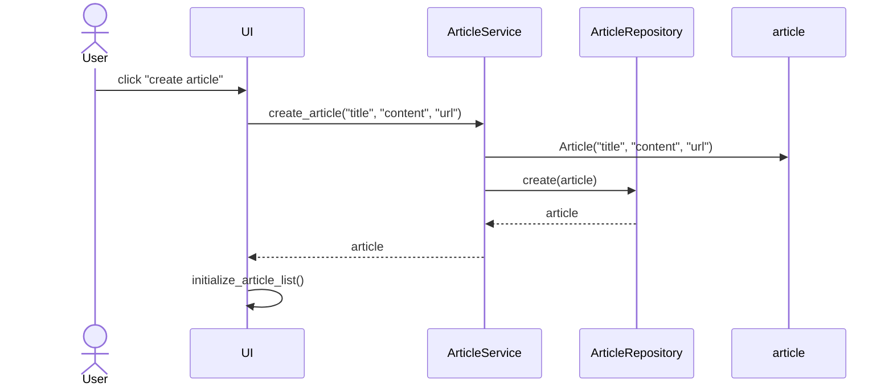

## Arkkitehtuurikuvaus

### Rakenne

Sovellus noudattaa kolmitasoista kerrosarkkitehtuuria

Pakkaus _ui_ sisältää käyttöliittymästä, _services_ sovelluslogiikasta ja _repositories_ tiedon tallennuksesta vastaavan koodin. Pakkaus _entities_ sisältää sovelluksen tietokohteita kuvaavat luokat.

### Artikkelin luominen

Uuden artikkelin luovan "create article"-painikkeen klikkaamisen jälkeen sovelluksen kontrolli etenee seuraavan sekvenssikaavion mukaisesti:

Tapahtumankäsittelijä kutsuu sovelluslogiikan metodia create_article antaen parametreiksi luotavan artikkelin tiedot. Sovelluslogiikka luo uuden `Article`-olion ja tallettaa sen kutsumalla `ArticleRepository`:n metodia `create`. Tästä seurauksena on se, että käyttöliittymä päivittää näytettävät articlet kutsumalla omaa metodiaan `initialize_article_list`.
