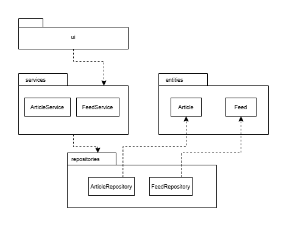

## Arkkitehtuurikuvaus

### Rakenne

Sovellus noudattaa kolmitasoista kerrosarkkitehtuuria

Pakkaus _ui_ sisältää käyttöliittymästä, _services_ sovelluslogiikasta ja _repositories_ tiedon tallennuksesta vastaavan koodin. Pakkaus _entities_ sisältää sovelluksen tietokohteita kuvaavat luokat.
