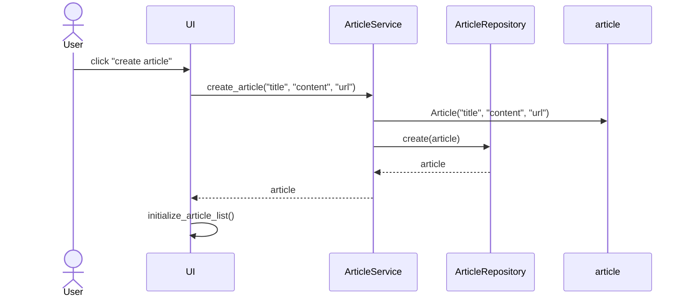
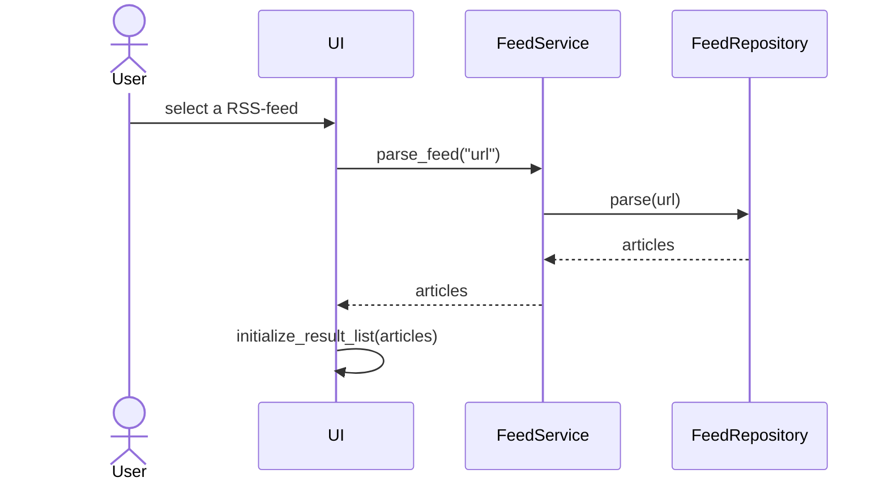

# Arkkitehtuurikuvaus

## Rakenne

Sovellus noudattaa kolmitasoista kerrosarkkitehtuuria


Pakkaus _ui_ sisältää käyttöliittymästä, _services_ sovelluslogiikasta ja _repositories_ tiedon tallennuksesta vastaavan koodin. Pakkaus _entities_ sisältää sovelluksen tietokohteita kuvaavat luokat.

## Käyttöliittymä

Käyttöliittymä sisältää viisi erilaista näkymää:

- Artikkeli-lista
- Artikkelin luominen
- Artikkelin lukeminen
- Artikkelin editointi
- Artikkelien etsiminen RSS-syötteestä

Jokainen näkymä on toteutettu omana luokkanaan, joista ainoastaa yksi on kerrallaan näkyvillä. Näkymien näyttämisestä vastaa [UI](../src/ui/ui.py)-luokka. Käyttöliittymä on pyritty eristämään sovelluslogiikasta. Se kutsuu ainoastaan [ArticleService](../src/services/article_service.py) ja [FeedService](../src/services/feed_service.py)-luokkien metodeja.

## Tietojen pysyväistallennus

Pakkauksen _repositories_ luokat `ArticleRepository` ja `FeedRepository` huolehtivat tietojen tallentamisesta. Tiedot tallennetaan JSON-tiedostoihin.

### Tiedostot

Sovellus tallentaa artikkelien ja syötteiden tiedot JSON-tiedostoihin.

Sovelluksen juureen voidaan luoda halutessa .env tiedosto, jossa tiedostojen nimet voidaan määritellä.

Sovellus tallettaa artikkelit JSON-tiedostoon seuraavassa formaatissa:

```
[
  {
    "id": "013603e5-4839-4cf8-b1ea-e579c430379a",
    "title": "otsikkoteksti",
    "content": "kontentti\n",
    "url": "osoite.com"
  },
  {
    "id": "c93c94c4-7d4b-48aa-82ae-381e650a10f0",
    "title": "toinen esimerkki",
    "content": "jotain kontenttia\n",
    "url": "osoite.fi"
  }
]
```

Eli artikkelin id, otsikko, sisältö, URL-osoite tallennetaan JSON-objektina listaan. 

## Päätoiminnallisuudet

Seuraavaksi kuvataan sovelluksen toimintalogiikkaa sekvenssikaavioiden avulla.

### Artikkelin luominen

Uuden artikkelin luovan "create article"-painikkeen klikkaamisen jälkeen sovelluksen kontrolli etenee seuraavan sekvenssikaavion mukaisesti:



Tapahtumankäsittelijä kutsuu sovelluslogiikan metodia create_article antaen parametreiksi luotavan artikkelin tiedot. Sovelluslogiikka luo uuden `Article`-olion ja tallettaa sen kutsumalla `ArticleRepository`:n metodia `create`. Tästä seurauksena on se, että käyttöliittymä päivittää näytettävät articlet kutsumalla omaa metodiaan `initialize_article_list`.


### RSS-syötteen lukeminen



### Muut toiminnallisuudet

Samat periaatteet toistuu kaikissa toiminnallisuuksissa, käyttöliittymän tapahtumankäsittelijä kutsuu sopivaa sovelluslogiikan metodia, joka päivittää artikkelien tilaa. Kontrollin palautuessa käyttöliittymään aktiivinen näkymä päivitetään.