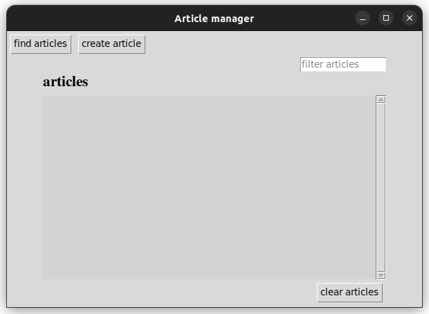

# Käyttöohje

Lataa projektin viimeisimmän [releasen](https://github.com/jipeso/ohjelmistotekniikka/releases) lähdekoodi valitsemalla _Assets_-osion alta _Source code_.

## Konfigurointi

Artikkelien tallennustiedoston nimeä muuttaa _.env_ tiedostossa. Tiedosto luodaan automaattisesti _data_-hakemistoon. Tiedoston nimi voidaan asettaa seuraavasti:

```
DATABASE_FILENAME=db.sqlite
```

## Ohjelman käynnistäminen

Ennen ohjelman käynnistämistä, asenna riippuvuudet komennolla:

```bash
poetry install --no-root
```

Jonka jälkeen tietokannan alustus tapahtuu komennolla:

```bash
poetry run invoke build
```

Nyt ohjelman voi käynnistää komennolla:

```bash
poetry run invoke start
```

## Päänäkymä

Sovellus käynnistyy artikkelien-listausnäkymään:




## Artikkelin luominen

Listausnäkymästä on mahdollista siirtyä uuden artikkelin luomisnäkymään painikkeella "create article".

Uusi artikkeli luodaan syöttämällä tiedot syötekenttiin ja painamalla "create"-painiketta:


## Artikkelin tarkastelu

Jos artikkelin luominen onnistuu, siirrytään takaisin listausnäkymään.

Luodun artikkelin tietoja voidaan tarkastella klikkaamalla artikkelin otsikkoa listassa.


Artikkeli voidaan poistaa artikkelilistalta lukunäkymän "delete article"-painikkeesta.

Artikkelia on myös mahdollista siirtyä muokkaamaan "edit article"-painikkeesta.

Lisäksi "back"-painikkeesta voidaan siirtyä takaisin listausnäkymään.

## Artikkelin muokkaaminen

Kun lukunäkymästä klikataan "edit article"-painiketta aukeaa editointinäkymä.


Tehdyt muutokset voidaan tallentaa "save changes"-painikkella tai palata lukemisnäkymään tallentamatta muutoksia "cancel"-painikkeesta.

## RSS-syötteen lukeminen

Artikkelien listausnäkymästä voidaan siirtyä etsimisnäkymään "find articles"-painikkeella.

Etsimisnäkymässä on mahdollista valita valikosta uutissivusto, jonka uutisotsikoita halutaan selata.

Syötteen valinnan jälkeen valikon alapuolelle ilmestyy mahdolliset tulokset.


Otsikkoa klikkaamalla voidaan tallentaa artikkeleja, jotka näkyvät palatessa listausnäkymään.
