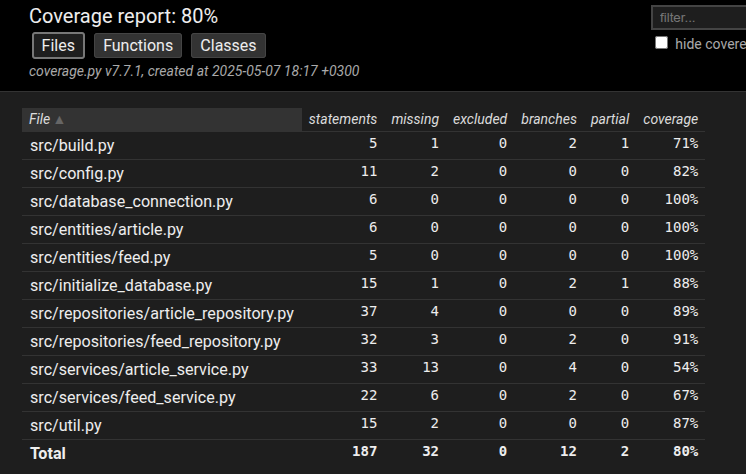

# Testausdokumentti

Ohjelmaa on testattu automatisoidiun yksikkö- ja integraatiotestein unittestilla sekä manuaalisesti järjestelmätasolla.

## Yksikkö- ja integraatiotestaus

### Sovelluslogiikka

Sovelluslogiikasta vastaavia `ArticleService`- ja `FeedService`-luokkia testataan [TestArticleService](https://github.com/jipeso/ohjelmistotekniikka/blob/main/src/tests/services/article_service_test.py)- ja [TestFeedService](https://github.com/jipeso/ohjelmistotekniikka/blob/main/src/tests/services/feed_service_test.py)-testiluokilla. `ArticleService`- ja `FeedService`-oliot alustetaan niin, että niille injektoidaan vastaavat repositorio-oliot, jotka tallentavat tietoa muistiin pysyväistallennuksen sijaan. Tätä varten on käytössä luokat `ArticleRepositoryStub` ja `FeedRepositoryStub`.

### Repositorio-luokat

Repositorio-luokkien `ArticleRepository` ja `FeedRepository` testaamiseen käytetään erilisiä testitiedostoja, joiden nimet on konfiguroitu _.env.test_-tiedostoon. `ArticleRepository` ja `FeedRepository`-luokkia testataan vastaavasti [TestArticleRepository](https://github.com/jipeso/ohjelmistotekniikka/blob/main/src/tests/repositories/article_repository_test.py)- ja [TestFeedRepository](https://github.com/jipeso/ohjelmistotekniikka/blob/main/src/tests/repositories/feed_repository_test.py)-testiluokilla.

### Testikattavuus

Käyttöliittymäkerrosta lukuunottamatta sovelluksen testauksen haaraumakattavuus on 80%.

Testaamatta jäivät `ArticleService`-luokan uusimmat metodit edit_article, filter_articles ja scrape_web_article sekä `FeedService`-luokan parse_feed metodi. Lisäksi _build.py_- ja _initialize\_database.py_-tiedostojen suorittaminen komentoriviltä ja jäi testaamatta.

## Järjestelmätestaus

Sovelluksen järjestelmätestaus on tehty manuaalisesti.

### Asennus ja konfigurointi

Sovellus on ladattu ja sitä on testattu [käyttöohjeen](./kayttoohje.md) mukaisesti Linux-ympäristössä.

Sovellusta on testattu Linuxilla tilanteissa, joissa artikkelit tallettavaa tiedostoa ei ole olemassa, jolloin ohjelma on luonut sen itse sekä tilanteissa, joissa tiedosto on ollut olemassa.

### Toiminnallisuudet

Kaikki [määrittelydokumentin](./vaatimusmaarittely.md#toiminnallisuus) ja käyttöohjeen listaamat toiminnallisuudet on testattu. Toiminnallisuuksien yhteydessä syötekentät on yritetty jättää tyhjiksi, muuten sovellus ei rajoita syötekenttiin syötettyjä arvoja.

### Sovellukseen jääneet laatuongelmat

Sovellus ei anna virheilmoituksia seuraavissa tilanteissa:

- Tietokantaa ei ole alustettu ennen sovelluksen käynnistämistä.
- Uuden artikkelin luomisnäkymässä "url"-kenttään syötetään virheellinen verkko-osoite.
