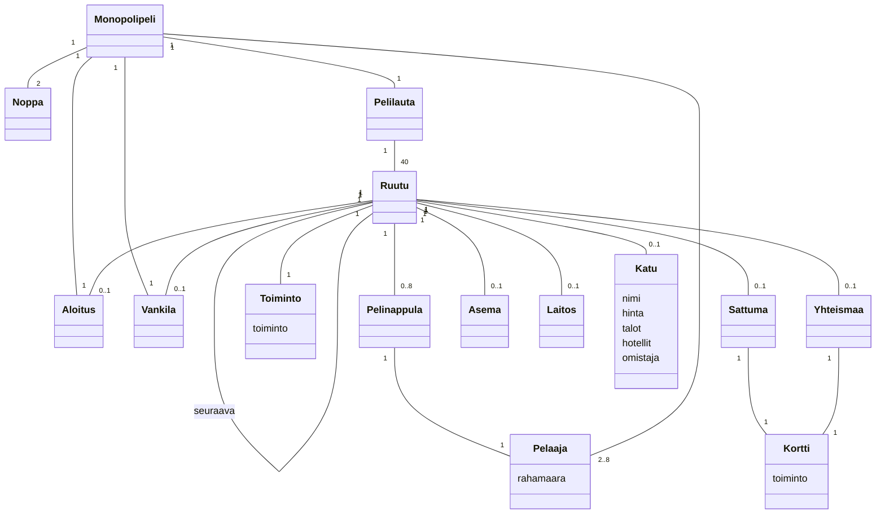

## Monopoli

```mermaid
 classDiagram
    Monopolipeli "1" -- "2" Noppa
    Monopolipeli "1" -- "1" Pelilauta
    Monopolipeli "1" -- "1" Aloitus
    Monopolipeli "1" -- "1" Vankila
    Pelilauta "1" -- "40" Ruutu
    Ruutu "1" -- "1" Ruutu : seuraava
    Ruutu "1" -- "0..8" Pelinappula
    Pelinappula "1" -- "1" Pelaaja
    Pelaaja "2..8" -- "1" Monopolipeli
    Ruutu "1" -- "1" Toiminto
    Ruutu "1" -- "0..1" Aloitus
    Ruutu "1" -- "0..1" Vankila
    Ruutu "1" -- "0..1" Sattuma
    Sattuma "1" -- "1" Kortti
    Yhteismaa "1" -- "1"  Kortti
    Ruutu "1" -- "0..1" Yhteismaa
    Ruutu "1" -- "0..1" Asema
    Ruutu "1" -- "0..1" Laitos
    Ruutu "1" -- "0..1" Katu


    class Monopolipeli
    class Ruutu
    class Aloitus
    class Vankila
    class Sattuma
    class Yhteismaa
    class Asema
    class Laitos
    class Katu {
        nimi
        hinta
        talot
        hotellit
        omistaja
    }

    class Kortti {
        toiminto
    }
    class Toiminto {
        toiminto
    } 

    class Pelaaja {
        rahamaara
    }

    class Pelinappula
    class Noppa
    class Pelilauta


```